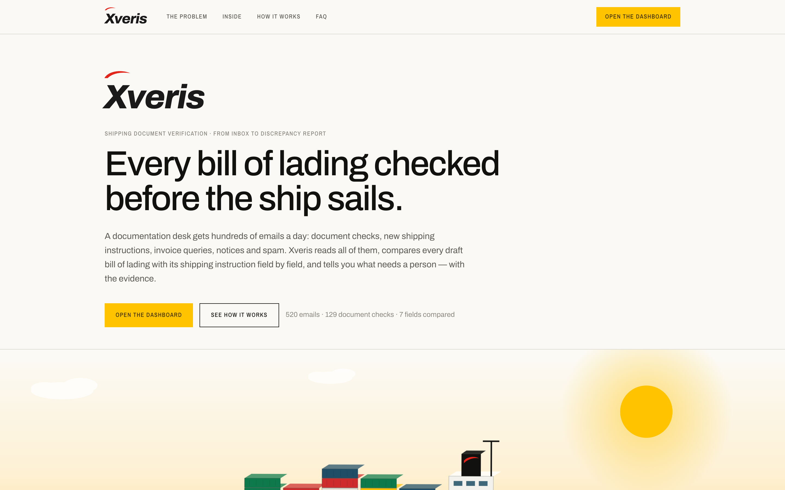
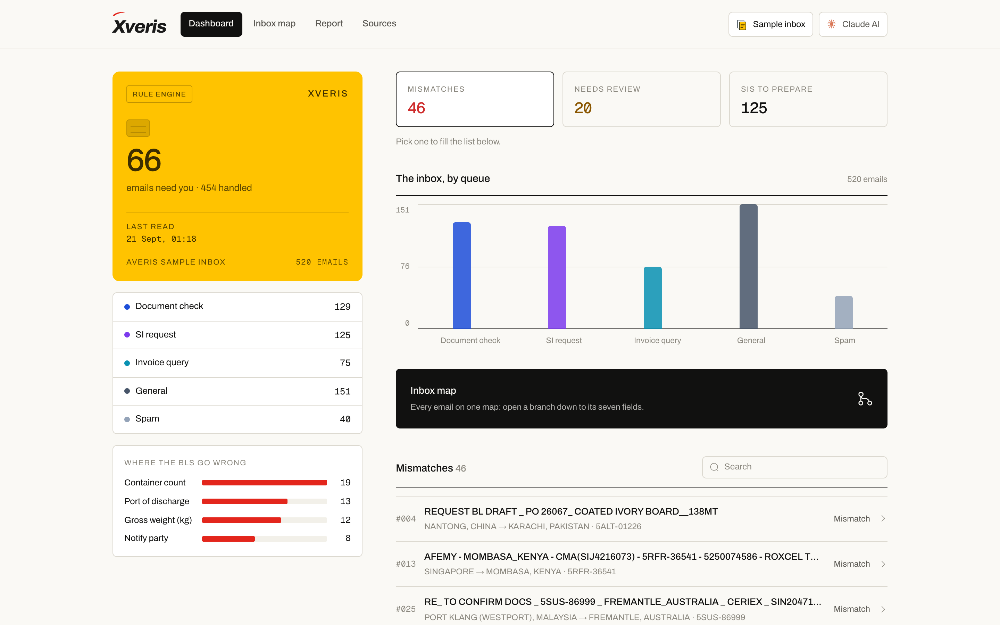
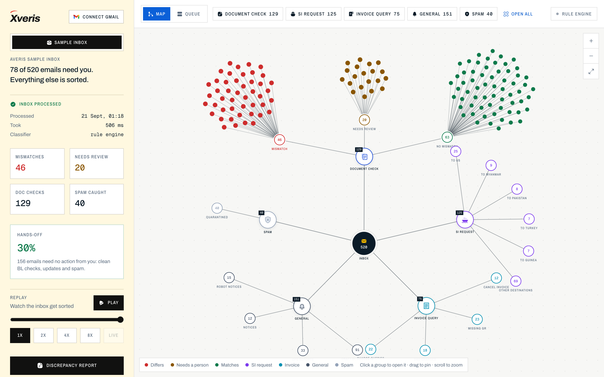
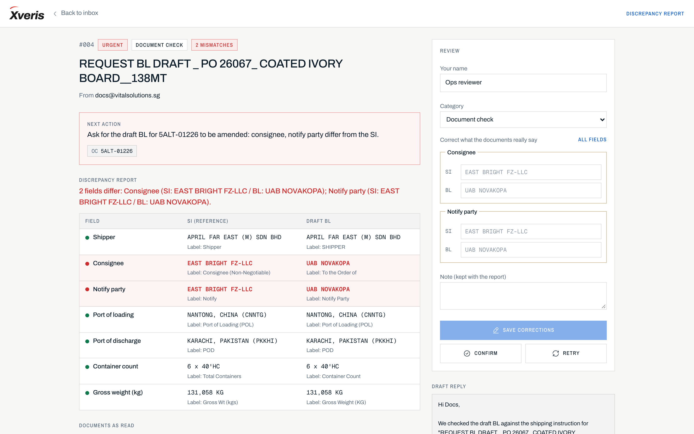
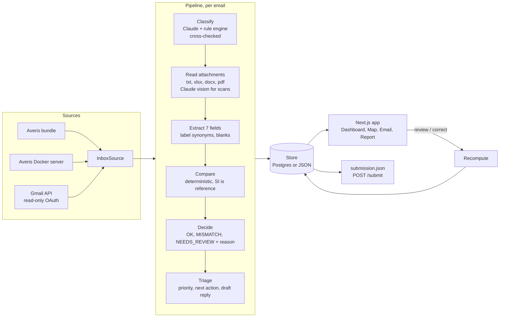

#  Xveris

Every bill of lading checked before the ship sails.

**Xveris connects to a shipping documentation desk's inbox, reads every email,
classifies it into five queues, compares each draft bill of lading against its
shipping instruction field by field, and hands the team only the few that a
person actually has to decide.**

**The comparison is deterministic code, never an LLM.** AI reads documents and
sorts mail; plain rules decide whether two values match, so every verdict is
reproducible and can be explained down to the line it came from.

Built by **Team Red Sea** for the **Averis x Monash Hackathon 2026** problem
statement, *Shipping document verification: from email inbox to discrepancy report*.




*The landing page at `/`: what Xveris is, and the ship that carries the cargo
those documents describe.*

---

## 🔗 Everything in one place

| | Link |
|---|---|
| 🌐 **Live prototype** | **[xveris.vercel.app](https://xveris.vercel.app)** — the full product, already processed, no setup |
| 🎬 **Demo video** | _link to follow_ |
| 📄 **Slide deck / documentation** | **[Technical architecture · implementation · challenges · roadmap](https://drive.google.com/file/d/1KD0RkDSA0RXf7ve2XDZWs3-J__fm9paD/view?usp=sharing)** |
| 💻 **Source code** | **[github.com/eyahia1712/Xveris](https://github.com/eyahia1712/Xveris)** — this repository |
| 📦 **Dataset** | The organisers' 520 emails and 250 attachments, bundled in [`data/sample/`](data/sample) |
| 🧪 **The checker, as tests** | [`lib/pipeline/pipeline.test.ts`](lib/pipeline/pipeline.test.ts) — 23 tests over the whole inbox |
| ⚡ **Run it yourself** | [Four commands](#-run-it), no API key required |

---

## 💡 Why

A documentation desk receives 500–1,000 emails a day in one shared mailbox: SI
and draft BL checks, new shipping instructions, invoice questions, automated
notices and spam. Two things go wrong, every day.

- **A request nobody finds is a request nobody checks.** Staff open every
  message just to work out what it needs. One document check buried in 500
  emails is how a wrong BL gets issued.
- **Comparing an SI with a BL by eye does not scale.** Seven fields, two
  different layouts, different label wording — "Port of Loading" here, "Load
  Port" there, `PORT OF LOADING (装货港)` in the next one. A missed consignee
  change means cargo released to the wrong company, amendment fees, and delay.

**On the organisers' 520-email dataset, 78 emails need a person.** The other
442 are sorted, checked or quarantined automatically — and each of the 78
arrives with its evidence and a drafted reply already written.

---

## ⚙️ How it works

### 📥 1. Connect an inbox

- The organisers' bundled dataset, their Docker server, or **your own Gmail**
  through read-only OAuth
- All three sit behind one `InboxSource` interface

**The pipeline never knows where the mail came from.**

---

### 🗂️ 2. Classify every email into five queues

- Document check · SI request · Invoice query · General · Spam
- Claude reads the body and the attachments and gives a reason
- A transparent rule engine classifies the same email **independently**, and
  any disagreement is flagged for a human

**Subject lines are recycled thread titles, so the body decides, not the subject.**

---

### 📄 3. Read the attachments, whatever the format

- `.txt`, `.xlsx`, `.docx` and text PDFs are parsed deterministically
- Image-only scans go to **Claude vision**
- A broken file is reported as unreadable — never guessed

**Every document is identified by its content, not its filename:** a file named
`_BL.txt` that is really a commercial invoice is caught and escalated.

---

### 🔍 4. Extract the seven fields by meaning

Shipper · Consignee · Notify party · Port of loading · Port of discharge ·
Container count · Gross weight (kg)

- Labels are reduced to a canonical form and matched against synonyms
  (`POL`, `Load Port`, `PORT OF LOADING (装货港)`)
- Placeholders — `N/A`, `TBA`, `____MT`, `???` — are treated as **missing**,
  never as data
- The source line of every value is kept as evidence

---

### ⚖️ 5. Compare deterministically

- The SI is the reference; the BL is checked against it
- `131,058 KG` equals `131058`; `SINGAPORE, SINGAPORE (SGSIN)` equals `SINGAPORE`
- A wrong port is caught **even when the UN/LOCODE was copied across unchanged**

**An LLM never decides that two values match.** Zero formatting false alarms on
the full dataset, enforced by a test.

---

### 🙋 6. Escalate instead of guessing

- A missing attachment, an unreadable file, the wrong document type or a blank
  value goes to review **with the reason and the evidence**
- A reviewer confirms or types the correct value, and the comparison recomputes
  under the same rules — so a review can turn into a caught mismatch

**Human-in-the-loop is a first-class screen, not an afterthought.**

---

### ✉️ 7. Triage, and reply

- Every email gets a priority and a next action: *"Ask for the draft BL for
  5ALT-01226 to be amended: consignee and notify party differ from the SI."*
- Mismatches get a drafted reply that quotes both values
- **Copy reply** puts it on the clipboard; **Send reply** sends it from the
  connected mailbox after a confirmation that names the recipient

**The team works from a short queue, not from an inbox.**

---

## 🖥️ The product



*The dashboard: how many emails need you, the five queues, where the BLs go
wrong, and the work itself. Every number leads to the emails behind it.*



*The inbox map: the mailbox at the centre, five queues around it, and the
document check opened into Mismatch (red), Needs review (amber) and No mismatch
(green). Click a group to grow its emails, click an email to grow its SI, BL,
verdict and seven fields.*



*One email, end to end: SI against BL with the source label of every value, the
documents as they were read, the full pipeline trace, the classification
rationale, the drafted reply and the review form.*

| Page | What it is |
|---|---|
| **/** | The landing page: the problem, the product, how it works, FAQ |
| **/dashboard** | What needs you now — queues, defects by field, the work list, search |
| **/inbox** | The inbox map and the queue view, with replay |
| **/emails/[id]** | One email: comparison, documents, trace, reply, review form |
| **/report** | The printable discrepancy report the brief asks for |
| **/connect** | Sources: sample inbox, Gmail, Claude, Outlook |
| **/docs** | Architecture, how to run it, self-evaluation |

---

## 📊 Results on the sample inbox

520 emails · 250 attachments · no AI key required

| Measure | Result |
|---|---|
| Emails classified | **520 / 520**, no processing failures |
| Document checks | **129** — 46 mismatch, 20 needs review, 63 no mismatch |
| Trap cases escalated with the correct reason | **20 / 20** — 5 wrong document types, 5 missing attachments, 2 corrupt PDFs, 3 image-only scans, 5 blank SI values |
| False alarms from formatting | **0** — every flagged field still differs after normalisation |
| Formats read | TXT, XLSX, DOCX, PDF (text), PDF (image-only, via Claude vision) |
| Full run time | ~500 ms on the rule engine |

`npm run process -- --source http://localhost:8080 --submit` runs the same
pipeline against the organisers' server and posts the official self-evaluation.

---

## 🏗️ Architecture



- **Pipeline** (`lib/pipeline/`) — pure TypeScript, no framework dependency. It
  runs identically in the web server, the CLI and the tests. Every stage writes
  an event, so a failure is visible and retryable per email.
- **AI** (`lib/ai/claude.ts`) — Claude (`claude-opus-5` by default) with
  schema-validated structured outputs and a server-side fallback. Used for
  classification, vision and unfamiliar layouts. **Never for comparison.**
- **Store** (`lib/store/`) — Postgres when `DATABASE_URL` is set, atomic JSON
  files otherwise. A committed snapshot means a fresh deployment opens on a
  fully processed inbox.
- **Graph** (`lib/viz/`, `components/viz/`) — the data builder, the d3-force
  layout and the canvas are three separate layers. Nodes keep stable "homes",
  so opening one branch never reshuffles the rest of the map.
- **Jobs** (`lib/server/jobs.ts`) — whole-inbox runs happen in the background
  with live progress; retry and review work per email.

**Scaling path:** every email is independent, so today's 8-way worker pool
becomes a queue (Cloud Tasks or Pub/Sub) with stateless workers, Gmail push
notifications (`users.watch`) replace polling, and a run moves from one JSON
document to one row per email.

---

## 🧱 Technology stack

| Layer | Technology | Why |
|---|---|---|
| App | Next.js 16, React 19, TypeScript (strict) | One deployable for UI, API and background jobs |
| AI | Claude via `@anthropic-ai/sdk`, structured outputs, PDF vision | Classification with a rationale; reads scanned documents |
| Documents | `exceljs`, `mammoth`, `unpdf` | Real parsing where the layout is known — no AI needed |
| Graph | `d3-force` + HTML/SVG canvas | Force layout with stable homes and wedge-packed clusters |
| Mail | Gmail API, OAuth2 (`gmail.readonly` + `gmail.send`) | Live inboxes; token in an AES-256-GCM encrypted httpOnly cookie |
| Data | Postgres (`pg`) or JSON files | Cloud database in production, zero setup locally |
| Cloud | Docker → Google Cloud Run (+ Cloud SQL), or Vercel | Scales to zero; the same image runs anywhere |
| Quality | Vitest, ESLint, zod at every API boundary | **23 tests, including the full 520-email inbox** |

---

## 🚀 Run it

```bash
npm install
cp .env.example .env.local     # optional: ANTHROPIC_API_KEY for AI + vision
npm run process                # process the bundled sample inbox
npm run dev                    # http://localhost:3000
npm test                       # 23 tests, including all 520 emails
```

**Without an API key Xveris still runs**, on the rule engine. Everything works
except the three image-only scans, which go to review as unreadable.

**Against the organisers' server:** `docker compose up --build` on their side,
then set `XVERIS_SOURCE_URL=http://localhost:8080`.

**Gmail:** create a "Web application" OAuth client in Google Cloud, enable the
Gmail API, add `<your-url>/api/gmail/callback` as a redirect URI, and set
`GOOGLE_CLIENT_ID`, `GOOGLE_CLIENT_SECRET` and `XVERIS_SECRET`.

### Deploy (Google Cloud Run)

```bash
gcloud run deploy xveris --source . --region asia-southeast1 --allow-unauthenticated \
  --set-env-vars XVERIS_PUBLIC_URL=https://<service-url> \
  --set-secrets ANTHROPIC_API_KEY=anthropic-key:latest,DATABASE_URL=xveris-db:latest \
  --min-instances 1 --no-cpu-throttling
```

`--no-cpu-throttling` keeps background runs alive between requests. On Vercel,
set `DATABASE_URL` to a managed Postgres — the serverless filesystem is not
writable, so the JSON store cannot be used there.

---

## ☁️ Cloud services

Every service is one environment variable away; nothing needs a code change.

| Service | Off | On |
|---|---|---|
| Hosting | Local `next start` | Cloud Run (`Dockerfile`) or Vercel |
| Database | JSON files under `data/` | Postgres — set `DATABASE_URL` |
| AI | Rule engine only | Claude API — set `ANTHROPIC_API_KEY` |
| Mail | Bundled sample inbox | Gmail API — set the three Google variables |
| Scheduler | Manual runs | Cloud Scheduler → `/api/cron`, set `CRON_SECRET` |

---

## 🔒 Security

- **Gmail is read-only for reading.** Sending uses a separate scope and only
  ever happens from a reply a human confirmed, with the recipient shown first.
- **The refresh token never touches the server's disk or database.** It lives
  AES-256-GCM encrypted in the user's own httpOnly cookie, so disconnecting is
  deleting a cookie and one user can never reach another's mailbox.
- OAuth uses a CSRF `state` cookie and verifies the Google ID token.
- Every API body is zod-validated with size limits; email ids are
  pattern-checked and attachment paths cannot escape the inbox folder.
- Spam is quarantined with "do not click links or reply", and email bodies are
  rendered as text, never as HTML.
- The sample dataset contains real companies' addresses, so **Xveris refuses to
  deliver replies for the sample inbox** — it hands the written reply to the
  reviewer's own mail client instead.

---

## ⚠️ Known limitations

- The rule engine is tuned on the sample inbox. Real mailboxes lean on the
  Claude classifier; the disagreement flag shows where the two differ.
- Party names are compared on the company-name line, so an address-only change
  is not flagged.
- Port aliases ("JNPT" for "Nhava Sheva") are not in a gazetteer yet. They show
  as a mismatch for a reviewer to correct.
- The background job runs in-process; a multi-instance deployment should move
  it to Cloud Tasks (see the scaling path).
- Opening all 520 emails on the map at once is legible but dense — the map is
  designed to be opened one queue at a time.

---

## ❓ Judge defence (short form)

- **"Where is the AI?"** Claude classifies every email and says why, reads
  image-only PDFs with vision, and maps layouts the parser has not seen. The
  rule engine is an independent cross-check and an offline fallback.
- **"Why not let the LLM compare the fields?"** Because "does this BL match its
  SI" must be reproducible and explainable to the value. Normalisation plus
  explicit rules gives zero formatting false alarms and the same answer every
  time. AI reads; code decides.
- **"What if a document cannot be read?"** It becomes a review with the
  parser's own error, never a guess. A reviewer types the values, and the
  comparison recomputes — so a review can become a caught mismatch.
- **"How do I see a failure?"** Every email page carries its full pipeline
  trace: each stage, each retry, each error, with timings.
- **"Does it work without an API key?"** Yes. That is how the demo runs, and it
  is why the numbers above are reproducible by anyone who clones this repo.

---

## 👥 Team Red Sea

Five students from Lincoln University College and Monash University. Xveris was
designed, built, tested and deployed during the hackathon.

| Member | Role | Institution | GitHub | LinkedIn |
|---|---|---|---|---|
| **Eya Hia** | Team lead — full-stack & AI pipeline | Lincoln University College | [@eyahia1712](https://github.com/eyahia1712) | [eya-hia](https://www.linkedin.com/in/eya-hia) |
| **Shah Rabbi Hasan Foyej** | Documents — parsing & field extraction | Lincoln University College | [@foyej-14](https://github.com/foyej-14) | [foyej](https://www.linkedin.com/in/foyej) |
| **Abu Sadat Md Sayem** | Cloud — deployment & DevOps | Lincoln University College | [@abuxadat](https://github.com/abuxadat) | [abusadatmdsayem](https://www.linkedin.com/in/abusadatmdsayem) |
| **Lai Cen Yee** | Backend — API & rule engine | Monash University | [@lcylaicenyee](https://github.com/lcylaicenyee) | [cen-yee-lai](https://www.linkedin.com/in/cen-yee-lai-7158a142b/) |
| **Lwin Win** | Frontend — dashboard & inbox map | Lincoln University College | [@lwinwin786-web](https://github.com/lwinwin786-web) | [lwin-win](https://www.linkedin.com/in/lwin-win-685b993a2) |

---

## 📚 Documentation

- **[Full project documentation (PDF)](https://drive.google.com/file/d/1KD0RkDSA0RXf7ve2XDZWs3-J__fm9paD/view?usp=sharing)** — technical
  architecture with diagrams, implementation details, challenges faced, future roadmap
- **`/docs`** in the running app — architecture, how to run it, self-evaluation
- **`.env.example`** — every environment variable, with what it switches on
- **`lib/pipeline/pipeline.test.ts`** — the checker's behaviour, stated as tests
  over the whole sample inbox

---

*Xveris · Team Red Sea · Averis x Monash Hackathon 2026*
